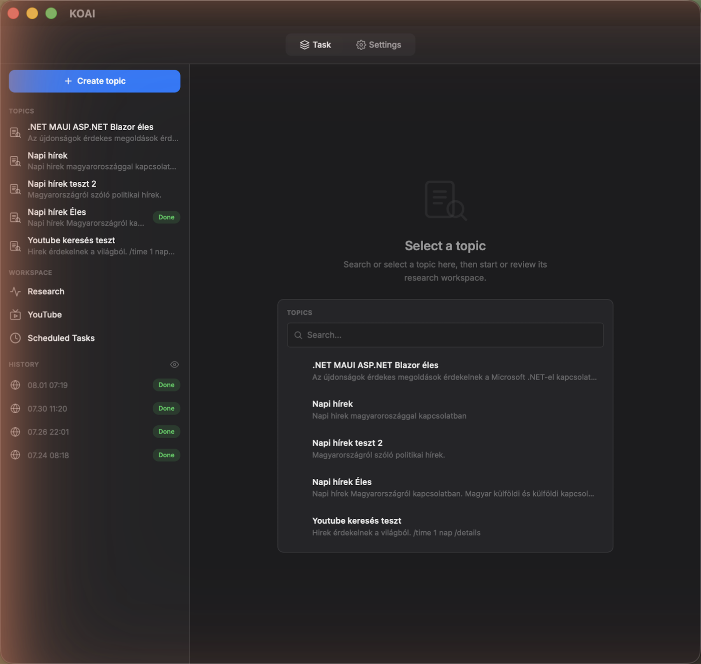
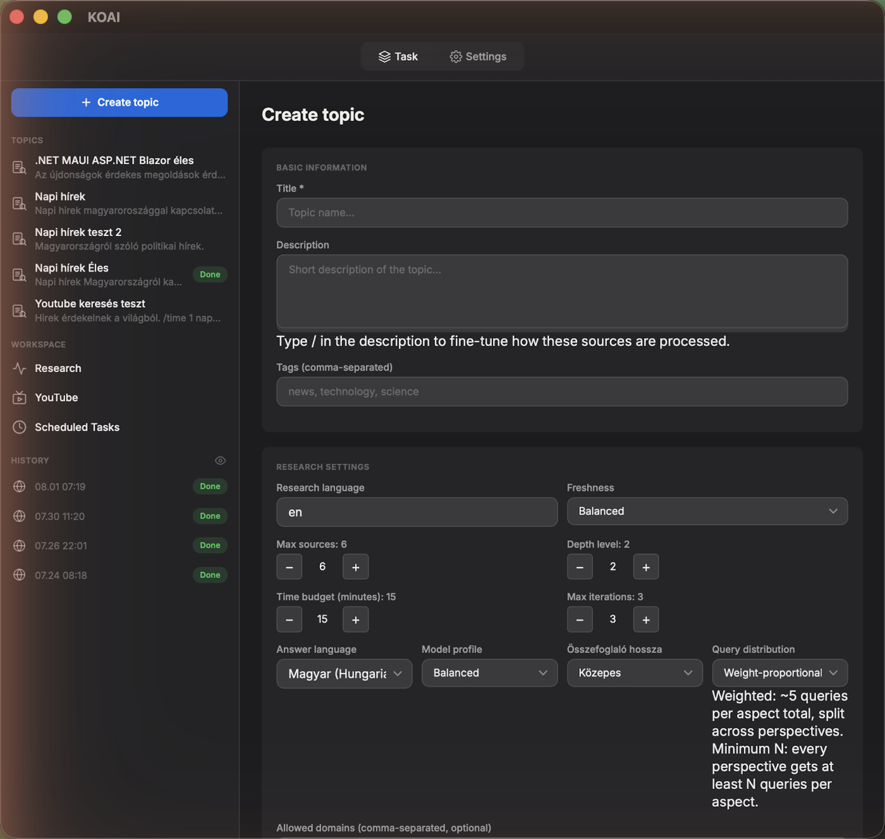
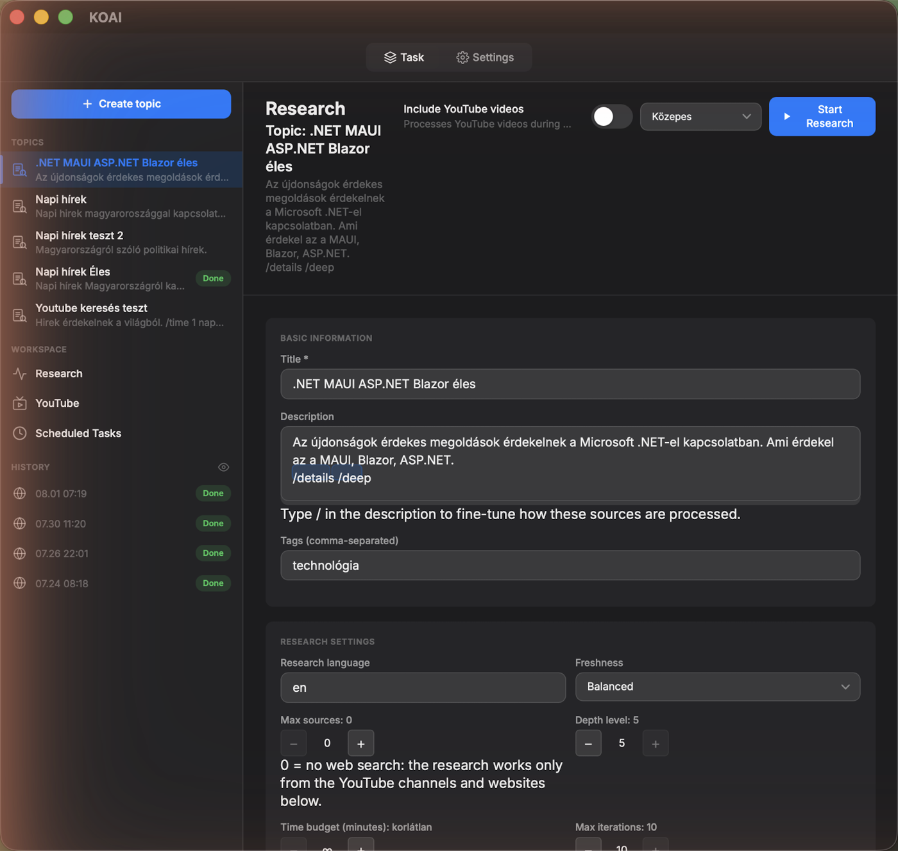
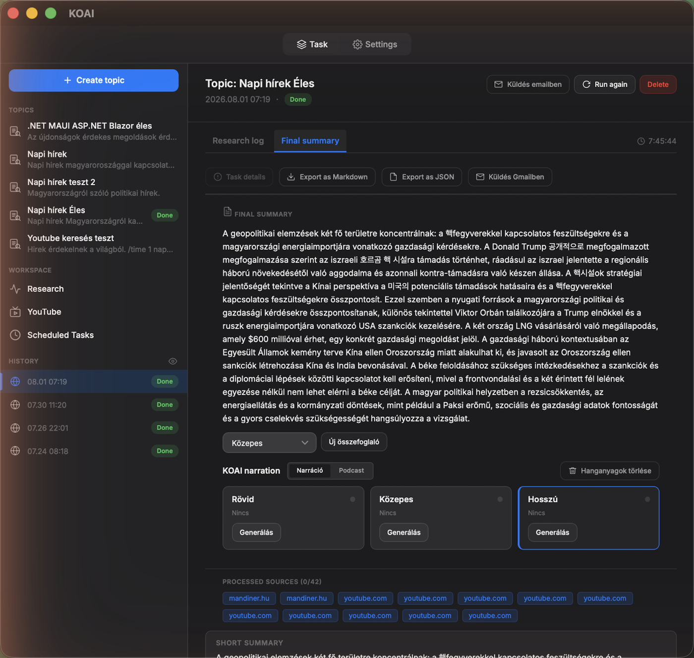
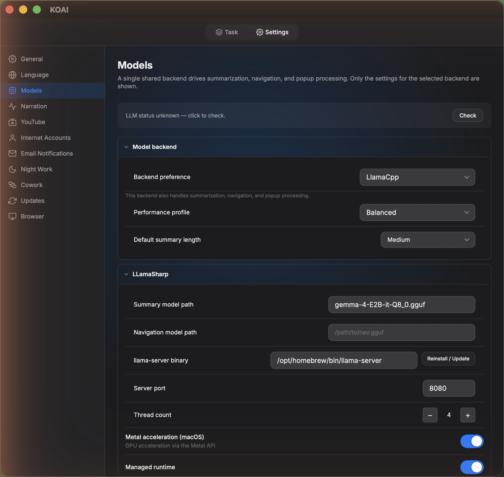
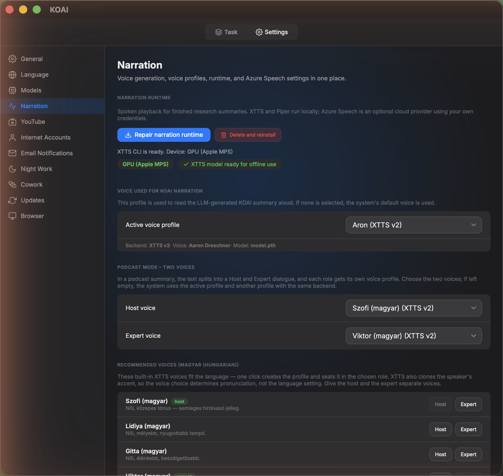

# KOAI

**KOAI** is a desktop research assistant for Windows and macOS. Give it a topic, and it searches the web in the background, reads the pages it finds, and writes you a clear, sourced summary — using an AI model that can run entirely on your own computer, with no cloud account required.

*The main window: your topics and research history on the left, ready to pick up where you left off.*

## What KOAI does

1. **You create a topic** — a subject, question, or story you want to keep track of (e.g. "news about my industry", "a technology I'm learning", "a company I'm researching").
2. **KOAI searches and reads for you** — it runs web searches in the background, opens the promising pages, and extracts the actual readable content (not just snippets).
3. **It summarizes what it found** — each source gets a short summary, and all of them are combined into one final report you can actually read in a few minutes.
4. **You review everything** — every search, every page it opened, and every source it used is kept, so you can check where a claim came from.
5. **Optionally, it reads the report to you** — KOAI can turn a report into spoken narration, or even a two-voice "podcast" conversation between a host and an expert.

*Starting a new topic: give it a name, a short description, and tell KOAI how deep to dig.*

*Every topic is configurable — how many sources to check, how recent they should be, and how much detail to go into.*

*The result: one readable report, with the full list of sources it was built from, and one-click narration.*

## Why run the AI model locally?

Most AI research tools send everything you type to a company's servers. KOAI can do the opposite: it can run the language model **on your own machine**, so your topics, your sources, and your reports never have to leave your computer.

**Advantages of a local model:**

- **Privacy** — nothing about what you're researching is sent anywhere. This matters for personal topics, work you can't share, or anything sensitive.
- **No per-use cost** — once the model is downloaded, summarizing is free. You're not paying per request or per token.
- **Works offline** — after the initial model download, KOAI can browse (given a network) and summarize without needing a cloud AI service to be reachable.
- **No accounts, no API keys, no rate limits** — nothing to sign up for, nothing that can suddenly change price or get shut off.
- **You choose the model** — KOAI includes a browser for Hugging Face models, so you can pick one that fits your machine and your needs.

**The trade-off:** a local model is only as fast and as capable as your hardware. A small laptop can still summarize articles, but a bigger, more capable model needs more memory and will run faster with a modern GPU.

If you ever want more power than your machine can give, KOAI can also fall back to a cloud model through OpenRouter (using your own API key), or work with no AI model at all using a simpler extractive summary.

*Under the hood: KOAI runs the model with `llama.cpp`, with automatic Apple Silicon GPU (Metal) acceleration on Mac.*

## What machine do you need?

KOAI runs on both **macOS** and **Windows**. Here's what to expect:

| | Minimum | Recommended |
|---|---|---|
| **Memory (RAM)** | 8 GB | 16 GB or more |
| **Mac** | Apple Silicon (M1 or newer) | Apple Silicon with 16 GB+ unified memory |
| **Windows** | Modern multi-core CPU | Modern multi-core CPU, 16 GB+ RAM |
| **Storage** | ~5 GB free for a model | More if you keep several models |

- On **Apple Silicon Macs**, KOAI can offload the model to the GPU (Metal), which makes summarization noticeably faster. With only 8 GB of unified memory, KOAI automatically keeps the model on the CPU instead — slower, but safe and stable.
- On **Windows**, the model currently runs on the CPU. A faster, multi-core CPU and more RAM both directly translate to faster summaries.
- The app itself is light. The hardware requirement really comes from the AI model you choose — smaller models (a few GB) run comfortably on modest hardware; larger, more capable models want more RAM.
- No local hardware is powerful enough? Switch to the OpenRouter cloud backend in settings, or use KOAI without any AI model at all (extractive summaries).

## Local model backends

KOAI supports several ways to run AI, chosen in **Settings → Models**:

- **llama.cpp** — runs GGUF models directly on your machine (the default, recommended local option)
- **Ollama** — if you already run models through Ollama
- **OpenRouter** — an optional cloud fallback using your own API key (stored securely in your OS's credential store, never in plain settings)
- **Extractive** — no AI model at all; KOAI still finds and organizes sources for you

*A bonus feature: turn any report into a spoken narration — or a two-voice podcast — entirely with a local text-to-speech engine.*

## Good to know

- The interface is available in English and Hungarian.
- Every research run keeps a full trace: what was searched, what was opened, and what was found — so you can always check the app's work.
- Your data (topics, sources, reports) stays in a local database on your machine.

---

# KOAI

A **KOAI** egy asztali kutatóasszisztens Windowsra és macOS-re. Megadsz egy témát, ő pedig a háttérben végigkeresi a webet, elolvassa a talált oldalakat, és készít belőle egy világos, forrásokkal alátámasztott összefoglalót — olyan AI-modellel, amely akár teljes egészében a saját gépeden is futhat, felhős fiók nélkül.

*A főablak: a témáid és a kutatási előzményeid bal oldalt, bármikor folytathatod, ahol abbahagytad.*

## Mit csinál a KOAI

1. **Létrehozol egy témát** — egy témakört, kérdést vagy ügyet, amit követni szeretnél (pl. "hírek a szakmámból", "egy technológia, amit tanulok", "egy cég, amit kutatok").
2. **A KOAI keres és olvas helyetted** — a háttérben webes kereséseket futtat, megnyitja az ígéretes oldalakat, és kinyeri a valódi, olvasható tartalmat (nem csak a kereső találati szövegét).
3. **Összefoglalja, amit talált** — minden forrás kap egy rövid összefoglalót, ezeket pedig egyetlen végső riportba fűzi össze, amit pár perc alatt át tudsz olvasni.
4. **Te ellenőrzöl mindent** — minden keresés, minden megnyitott oldal és minden felhasznált forrás megmarad, így bármikor visszanézheted, honnan származik egy állítás.
5. **Opcionálisan fel is olvassa a riportot** — a KOAI a riportot élőszóban felolvasott narrációvá, vagy akár két hangos "podcast" beszélgetéssé is tudja alakítani egy műsorvezető és egy szakértő között.

*Új téma indítása: adj neki nevet, egy rövid leírást, és mondd meg, milyen mélyen ássa bele magát.*

*Minden téma testre szabható — hány forrást nézzen át, mennyire legyenek frissek, és milyen mélységig menjen bele.*

*Az eredmény: egy jól olvasható riport, a hozzá tartozó teljes forráslistával, és egy kattintásos narrációval.*

## Miért érdemes helyben futtatni az AI-modellt?

A legtöbb AI-alapú kutatóeszköz mindent egy cég szerverére küld, amit begépelsz. A KOAI ennek épp az ellenkezőjét is tudja: a nyelvi modellt **a saját gépeden** futtathatja, így a témáid, a forrásaid és a riportjaid soha nem kell, hogy elhagyják a számítógépedet.

**A helyi modell előnyei:**

- **Adatvédelem** — semmi nem kerül el arról, hogy mit kutatsz. Ez számít személyes témáknál, meg nem osztható munkaanyagoknál, vagy bármi érzékenynél.
- **Nincs használat alapú költség** — ha egyszer letöltötted a modellt, az összefoglalás ingyenes. Nem fizetsz kérésenként vagy tokenenként.
- **Offline is működik** — a modell letöltése után a KOAI (hálózat megléte esetén böngészik és) összefoglal anélkül, hogy egy felhős AI-szolgáltatásnak elérhetőnek kellene lennie.
- **Nincs fiók, nincs API-kulcs, nincs korlátozás** — nincs mire regisztrálni, és nincs ami hirtelen drágulhat vagy leállhat.
- **Te választod ki a modellt** — a KOAI beépített Hugging Face modellböngészőt kínál, így olyat választhatsz, ami passzol a gépedhez és az igényeidhez.

**A kompromisszum:** egy helyi modell csak annyira gyors és csak annyira tud, amennyit a hardvered engedélyez. Egy kisebb laptop is simán összefoglal cikkeket, de egy nagyobb, tudásban erősebb modellhez több memória kell, és modern GPU-val fut gyorsabban.

Ha valaha többre lenne szükséged, mint amit a géped nyújtani tud, a KOAI át tud váltani egy felhős modellre is az OpenRouteren keresztül (a saját API-kulcsoddal), vagy AI-modell nélkül, egyszerűbb, kivonatoló összefoglalóval is tud dolgozni.

*A motorháztető alatt: a KOAI a `llama.cpp`-vel futtatja a modellt, Mac gépeken automatikus Apple Silicon GPU-gyorsítással (Metal).*

## Milyen gép kell hozzá?

A KOAI **macOS-en** és **Windowson** is fut. Amire számíthatsz:

| | Minimum | Ajánlott |
|---|---|---|
| **Memória (RAM)** | 8 GB | 16 GB vagy több |
| **Mac** | Apple Silicon (M1 vagy újabb) | Apple Silicon, 16 GB+ unified memory |
| **Windows** | Modern, több magos CPU | Modern, több magos CPU, 16 GB+ RAM |
| **Tárhely** | ~5 GB szabad hely egy modellhez | Több, ha egyszerre több modellt is tartasz |

- **Apple Silicon Mac** esetén a KOAI a modellt a GPU-ra (Metal) is tudja tölteni, ami érezhetően felgyorsítja az összefoglalást. Ha csak 8 GB unified memory van, a KOAI automatikusan a CPU-n futtatja a modellt — lassabb, de biztonságos és stabil.
- **Windowson** a modell jelenleg CPU-n fut. Egy gyorsabb, több magos CPU és több RAM közvetlenül gyorsabb összefoglalást jelent.
- Maga az alkalmazás könnyű. A hardverigényt valójában a kiválasztott AI-modell adja — a kisebb modellek (néhány GB) szerényebb gépeken is kényelmesen futnak, a nagyobb, tudásban erősebb modellekhez pedig több RAM kell.
- Nincs elég erős helyi géped? Válts a felhős OpenRouter backendre a beállításokban, vagy használd a KOAI-t AI-modell nélkül (kivonatoló összefoglalással).

## Helyi modell backendek

A KOAI többféle AI-futtatást támogat, a **Beállítások → Modellek** menüben választhatóan:

- **llama.cpp** — GGUF modelleket futtat közvetlenül a gépeden (az alapértelmezett, ajánlott helyi opció)
- **Ollama** — ha már Ollamán keresztül futtatsz modelleket
- **OpenRouter** — opcionális felhős tartalék a saját API-kulcsoddal (biztonságosan, az operációs rendszer saját hitelesítő-tárolójában, sosem sima beállításként tárolva)
- **Extractive (kivonatoló)** — AI-modell nélkül; a KOAI így is megkeresi és rendszerezi a forrásokat neked

*Bónusz funkció: bármelyik riportot élőszóban felolvasott narrációvá — vagy két hangos podcasttá — alakíthatod, teljesen helyi szövegfelolvasó motorral.*

## Amit érdemes tudni

- A felület angolul és magyarul is elérhető.
- Minden kutatási futás teljes nyomvonalat őriz: mit keresett, mit nyitott meg, mit talált — így bármikor visszanézheted az app munkáját.
- Az adataid (témák, források, riportok) egy helyi adatbázisban maradnak a gépeden.
